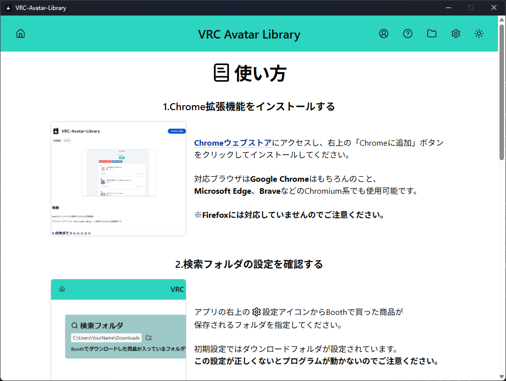
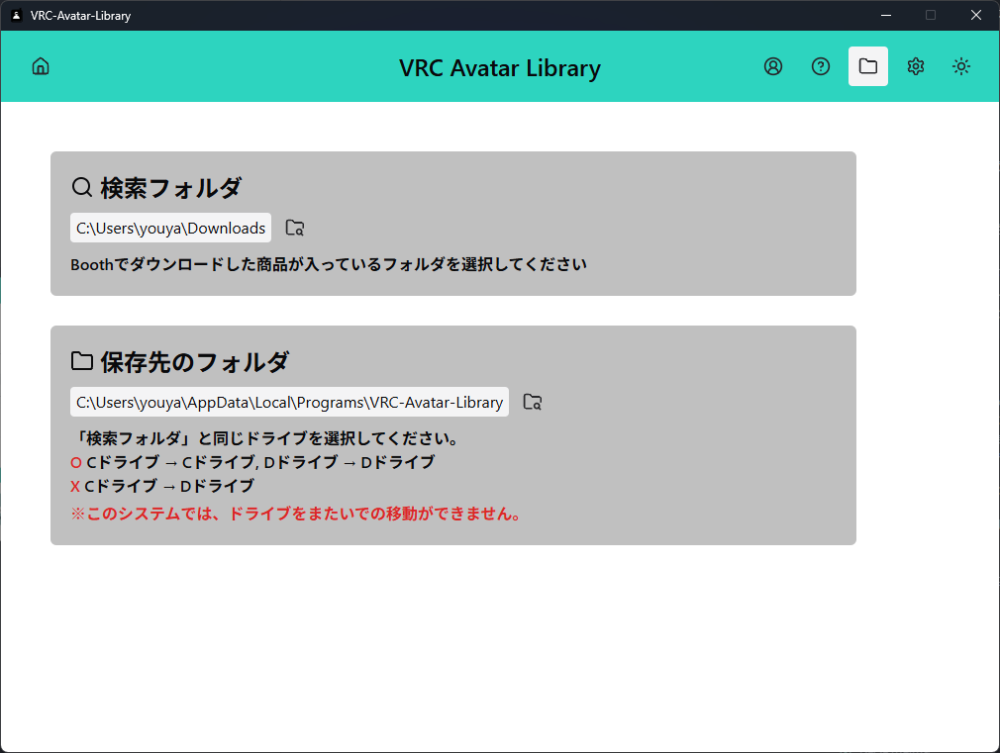

# フォルダーにサムネイルをつける VRC-Avatar-Library

### 🔗 各種リンク

> [!IMPORTANT]  
> **⚠️ デスクトップアプリ + Chrome拡張機能の両方が必須です**  
> 🖥️**デスクトップアプリ**と🧩**Chrome拡張機能**の両方がないと動作しません。必ず両方をダウンロード・インストールしてください。

### ✨ 概要
**VRC-Avatar-Library**は、VRChatユーザーのためのデスクトップアプリケーションです。
Boothで購入したアバター商品のフォルダに、**商品のサムネイル画像を自動でアイコンとして設定**し、アバターライブラリを視覚的に整理できます。

### 📖 開発経緯
VRChatユーザーの間で「Boothで購入したアバターのフォルダが分かりにくい」という課題がありました。

**きっかけ**は、X（旧Twitter）で手動でフォルダにサムネイルを設定する方法を紹介している投稿を見たことでした。実際に試してみると、**視認性が劇的に向上**し、アバター管理が格段に楽になりました。

しかし、**手動での作業は非常に手間**がかかります：
- 🖼️ Boothページからサムネイル画像を保存
- 🔄 画像をICO形式に変換  
- 📁 各フォルダに個別に設定

**「この作業を自動化できないだろうか？」**

そんな想いから生まれたのが、この**VRC-Avatar-Library**です。Chrome拡張機能とデスクトップアプリを連携させることで、ワンクリックでフォルダにサムネイルを設定できる環境を実現しました。

### 🚀 主な機能
- 📁 **自動フォルダアイコン設定**: Booth商品のサムネイルをフォルダアイコンに自動変換
- 🔗 **Chrome拡張機能連携**: ブラウザから直接処理を開始可能
- ⚡ **リアルタイム処理表示**: WebSocketによる処理状況のリアルタイム更新
- 🛠️ **簡単セットアップ**: 直感的なUI設計で初心者でも安心

### 💻 技術仕様
- [アプリ](https://github.com/tadanobutaaaaa/vrc_avatar_library)
    - **フロントエンド**  
    
    
    - **UI** 
    
    
    - **バックエンド**  
    
    
    
***
- [Chrome拡張機能](https://github.com/tadanobutaaaaa/vrc-avatar-library-extension)
    - **フレームワーク**  
    
    
    - **UI** 
    
    - **プログラミング言語**  
    

## 📸 スクリーンショット

### 🎯 メイン画面

メイン画面では、アプリやChrome拡張機能の詳しい使い方を知ることができます。

### ⚙️ 設定画面  

設定画面では、フォルダのパスを指定してアプリの動作を設定することができます。 

